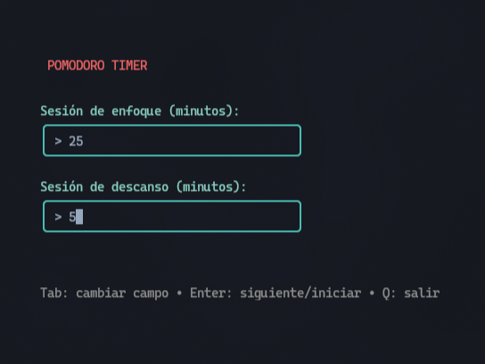
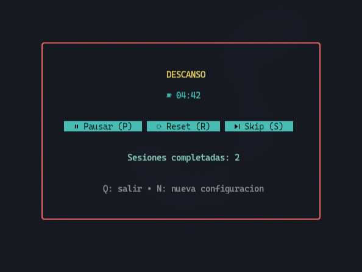

# 🍅 Pomodoro TUI

A beautiful and minimal Pomodoro timer for your terminal, built with Go and the Charm ecosystem.

<p align="center">
  
  
</p>

## ✨ Features

- **Customizable Sessions** - Set your own focus and break durations
- **Full Control** - Pause, resume, reset, and skip sessions with keyboard shortcuts
- **Session Tracking** - Keep count of completed focus sessions
- **Beautiful UI** - Clean interface with Nerd Font icons and vibrant colors
- **Keyboard Shortcuts** - Efficient workflow with intuitive keybindings
- **Lightweight** - Fast and minimal resource usage

## 📦 Installation

### Prerequisites

- Go 1.21 or higher
- A terminal with [Nerd Font](https://www.nerdfonts.com/) support (recommended)

### Install from source

```bash
git clone https://github.com/melisapo/pomogo.git
cd pomogo
go build -o pomogo
./pomogo
```

## 🚀 Usage

Simply run the program:

```bash
./pomogo
```

### Initial Setup

1. Enter your desired focus session duration (default: 25 minutes)
2. Press `Tab` or `Enter` to move to the next field
3. Enter your break duration (default: 5 minutes)
4. Press `Enter` to start the timer

### Keyboard Shortcuts

#### During Sessions

| Key | Action |
|-----|--------|
| `P` or `Space` | Pause/Resume timer |
| `R` | Reset current session |
| `S` | Skip to next session |
| `N` | Return to setup (new configuration) |
| `Q` or `Ctrl+C` | Quit application |

#### Setup Screen

| Key | Action |
|-----|--------|
| `Tab` | Switch between fields |
| `Enter` | Next field / Start timer |
| `Ctrl+C` | Quit |

## 🍅 The Pomodoro Technique

The Pomodoro Technique is a time management method that breaks work into focused intervals:

1. **Focus**: Work with full concentration (typically 25 minutes)
2. **Short Break**: Take a brief rest (typically 5 minutes)
3. **Repeat**: After 4 focus sessions, take a longer break (15-30 minutes)

This technique helps maintain high levels of focus and prevents burnout.


## 🛠️ Built With

- [Bubbletea](https://github.com/charmbracelet/bubbletea) - The TUI framework
- [Lipgloss](https://github.com/charmbracelet/lipgloss) - Style definitions and layout
- [Bubbles](https://github.com/charmbracelet/bubbles) - TUI components

## 📝 Project Structure

```
.
├── main.go        # Main application code
├── go.mod         # Go module definition
├── go.sum         # Dependency checksums
└── README.md      # This file
```

## 🤝 Contributing

Contributions are welcome! Feel free to:

- Report bugs
- Suggest new features
- Submit pull requests


## 🙏 Acknowledgments

- Built with the amazing [Charm](https://charm.sh/) TUI libraries
- Inspired by the Pomodoro Technique by Francesco Cirillo
- Icons from [Nerd Fonts](https://www.nerdfonts.com/)
